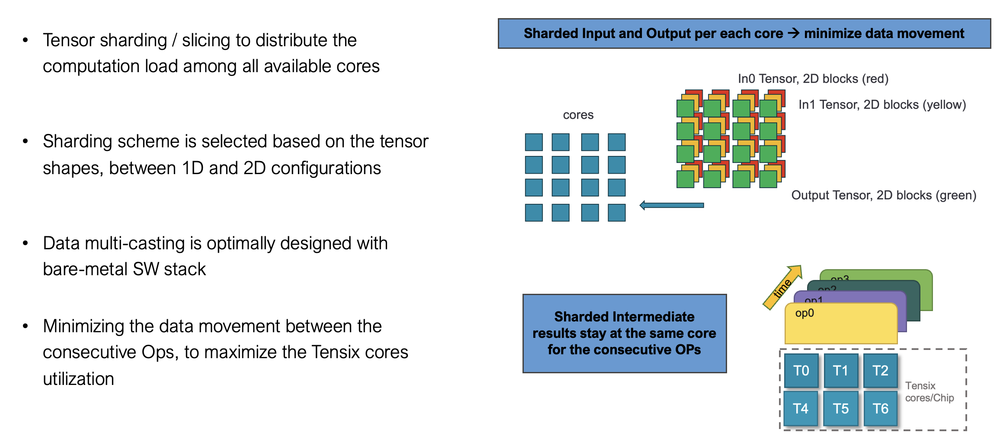
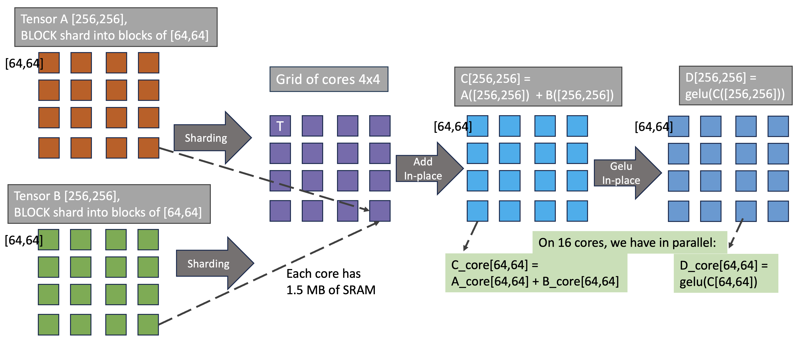
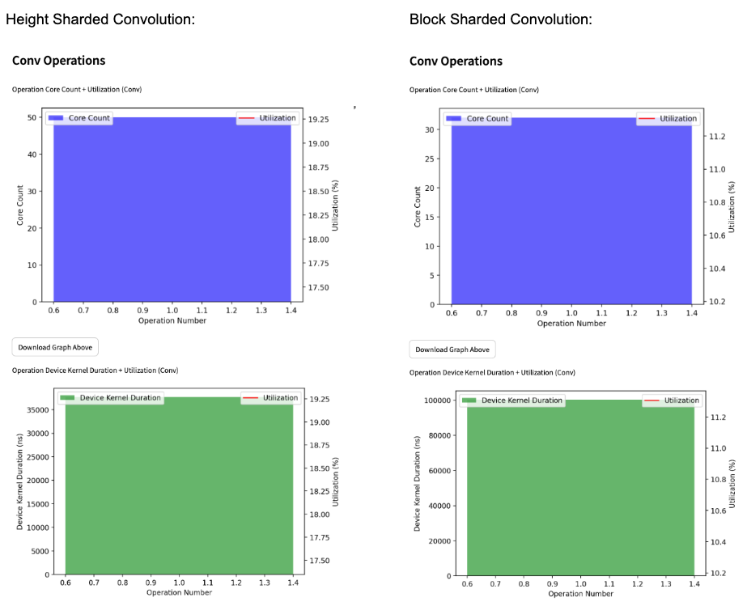
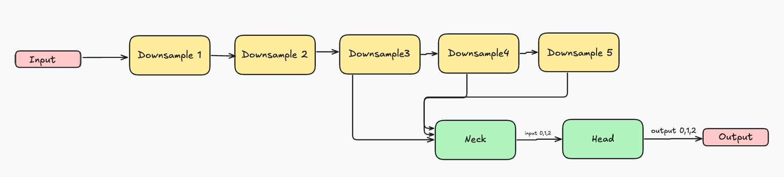
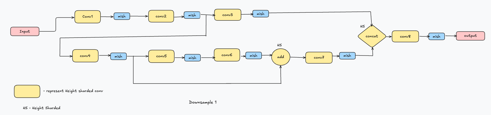
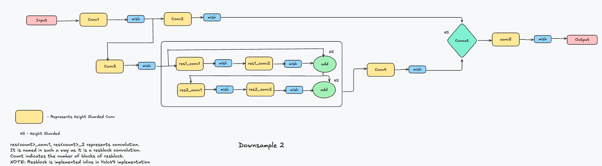
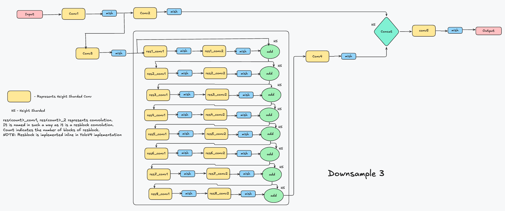
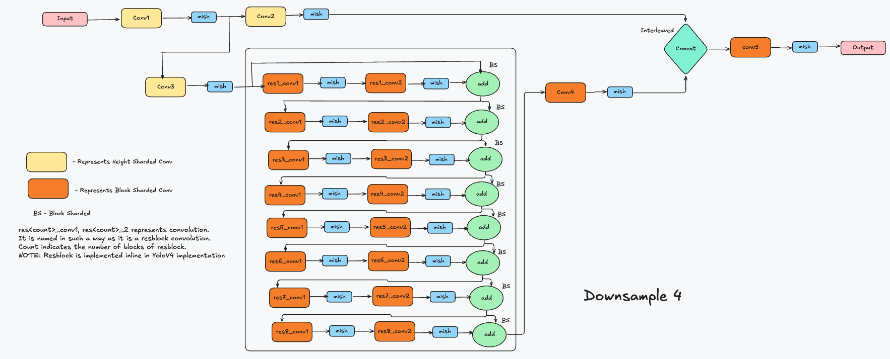

# Yolov4 in TT-NN

## Contents

- [YoloV4 in TT-NN](#yolov4-in-tt-nn)
  - [Contents](#contents)
  - [1. Overview](#1-overview)
  - [2. YoloV4 TT-NN Optimization Techniques](#2-yolov4-tt-nn-optimization-techniques)
    - [2.1 Sharding on all relevant OPs](#21-sharding-on-all-relevant-ops)
    - [2.2 Deallocate Unused tensors](#22-deallocate-unused-tensors)
    - [2.3 Data type Optimization](#23-data-type-optimization)
    - [2.4 Use Best shardlayout for convolution](#24-use-best-shardlayout-for-convolution)
  - [3. YoloV4 TT-NN Code Structure](#3-yolov4-architecture)
    - [3.1 Downsample1](#31-downsample1--)
    - [3.2 Downsample2](#32-downsample2--)
    - [3.3 Downsample3](#33-downsample3--)
    - [3.4 Downsample4](#34-downsample4--)


## 1. Overview

The [YOLOv4](https://arxiv.org/pdf/2004.10934) is a state-of-the-art object detection model that processes images in real time, identifying and localizing multiple objects within a single forward pass. It builds on the strengths of its predecessors while incorporating several advancements to improve accuracy and efficiency.

## 2. YoloV4 TT-NN Optimization Techniques

### 2.1 Sharding on all relevant OPs
  - Applying sharding techniques to harvest the optimum utilization of the computation OPs, by eliminating the need for data movement inter-tensix-cores between the consecutive OPs.
  - For more details, please refer to the [related tech-report](https://github.com/tenstorrent/tt-metal/blob/main/tech_reports/tensor_layouts/tensor_layouts.md#42-sharding)
  - Sharding Concepts

  - Illustrative example


Example:-

Functional Code:-
```python
        output_tensor = ttnn.sharded_to_interleaved(output_tensor, ttnn.L1_MEMORY_CONFIG)
        output_tensor_left = ttnn.sharded_to_interleaved(output_tensor_left, ttnn.L1_MEMORY_CONFIG)
        output_tensor = ttnn.concat([output_tensor, output_tensor_left], dim=3, memory_config=ttnn.L1_MEMORY_CONFIG)
```
Optimized Code:-
```python
        output_tensor = ttnn.to_layout(output_tensor, layout=ttnn.ROW_MAJOR_LAYOUT)
        output_tensor_left = ttnn.to_layout(output_tensor_left, layout=ttnn.ROW_MAJOR_LAYOUT)
        output_sharded_memory_config = ttnn.create_sharded_memory_config(
            [512, 128],
            core_grid=output_tensor_left.memory_config().shard_spec.grid,
            strategy=ttnn.ShardStrategy.HEIGHT,
            use_height_and_width_as_shard_shape=True,
        )
        output_tensor = ttnn.concat(
            [output_tensor, output_tensor_left], dim=3, memory_config=output_sharded_memory_config
        )
```

### 2.2 Deallocate Unused tensors

If you are not going to use the input which is passed to conv. We must dellocate it to reduce the memory usage.

Functional_code:-

```python
                conv_config = ttnn.Conv2dConfig(
                        deallocate_activation=False,
                    )
```

Optimized code:-
```python
            conv_config = ttnn.Conv2dConfig(
                        deallocate_activation=True,
                    )
```

And, Use `ttnn.deallocate(tensor)` API to deallocate tensor which is needed anymore. Doing this may not increase the perforamance of the model but it will help to deallocate the tensor from the memory and give space for other tensors to storage.

### 2.3 Data type Optimization
- Uses more efficient data types (e.g., `bfloat8_b`) to reduce memory usage and enhance computation speed.

- Similar to the functional implementation but uses more efficient data types and operations.


Functional Code:-

```python
              conv_config = ttnn.Conv2dConfig(
                        weights_dtype=ttnn.bfloat16,
              )
```

Optimized Code:-

```python
              conv_config = ttnn.Conv2dConfig(
                        weights_dtype=ttnn.bfloat8_b,
              )
```
### 2.4 Use best shardlayout for convolution

Using correct shard layout for convolution will increase the core_count of the conv/matmuls and also the performance will  be increased.

The shard_layout of convolution is choosen by i.e., it is advised to use BLOCK_SHARDED if C ~= N*H*W, HEIGHT_SHARDED if  N*H*W >>> C and WIDTH_SHARDED if C >>> N*H*W.

Example:-
Let's Take a input of size [1,60,80,128](NHWC Type), Kernel_size=(3,3),Padding=(1,1) and Stride=(1,1).

According to the above concept it is recommended to use `HEIGHT_SHARDED` because N*H*W >>> C.

In the below diagram its is clear that if we use  `HEIGHT_SHARDED` the Core_count of conv is higher and Device Kernel Duration(ns) is lesser whereas if we use  `BLOCK_SHARDED` the Core_count of conv is less and Device Kernel Duration(ns) is higher. As Well as the Uiltization is greater in case of `HEIGHT_SHARDED` compared to `BLOCK_SHARDED`.
The utilization line is not visible in below diagrams as we have only one conv. The utilization percentage number is available in the right y-axis of the graph. In this case the utilization is the hightest number available in the right y-axis of the graph.


#### How to generate the graph?
1. Need to Generate the Perf sheet,
    To Generate the Perf sheet:
     - Once build the profiler with help of command, `./scripts/build_scripts/build_with_profiler_opt.sh`.
     - Run the command, `./tt_metal/tools/profiler/profile_this.py -n <Folder_name> -c "pytest <path_to_test_file>"`, Where
     - Download the CSV file generated.(The csv file path will be generated in the terminal)
2. Open the link //tt-graph.streamlit.app/.
3. It will ask for Grayskull/Wormhole. Select the device which you used.
4. Upload the generated CSV file. It will show the graphical analysis of the perf sheet.

## 3. Yolov4 Architecture
The yolov4 model in our TT-NN implementation consists of 8 sub_modules including YoloV4 module.
- [Downsample1](#31-downsample1--)
- [Downsample2](#32-downsample2--)
- [Downsample3](#33-downsample3--)
- [Downsample4](#34-downsample4--)
- Downsample5
- Neck
- Head
- YoloV4

In TT-NN implementation we are not using resblock sub_module separately. We are using the resblock module inline wherever needed.

YoloV4 model consits of Convolution,Batch_norm,Mish,Concat,Addition,LeakRelu,Maxpool2d and Upsample operations. In our TT-NN implementationn we fold the Convolution and Batch_norm weights and bias and will pass to convolution operation.

The folding of convolution and bias is done through the following function,
```python
                def fold_batch_norm2d_into_conv2d(conv, bn):
                    if not bn.track_running_stats:
                        raise RuntimeError("BatchNorm2d must have track_running_stats=True to be folded into Conv2d")

                    weight = conv.weight
                    bias = conv.bias
                    running_mean = bn.running_mean
                    running_var = bn.running_var
                    eps = bn.eps
                    scale = bn.weight
                    shift = bn.bias
                    weight = weight * (scale / torch.sqrt(running_var + eps))[:, None, None, None]
                    if bias is not None:
                        bias = (bias - running_mean) * (scale / torch.sqrt(running_var + eps)) + shift
                    else:
                        bias = shift - running_mean * (scale / torch.sqrt(running_var + eps))

                    return weight, bias
```
As there a many convolution operations in YoloV4 model we have a common.py file which contains convolution, This is used the increase the readablitiy of the code and to reduce number of code lines.

```python
class Conv:
    def __init__(
        self,
        model,
        path,
        input_params,
        conv_params,
        *,
        act_block_h=None,
        reshard=False,
        deallocate=True,
        height_sharding=True,
        activation="",
        fused_op=True,
        width_sharding=False,
    ) -> None:
        if fused_op:
            self.weights, self.bias = fold_bn_to_conv_weights_bias(model, path)
        else:
            weight = model[path + ".conv.0.weight"]
            bias = model[path + ".conv.0.bias"]
            self.weights = ttnn.from_torch(weight)
            bias = bias.reshape(1, 1, 1, -1)
            self.bias = ttnn.from_torch(bias)
        self.input_params = input_params
        self.kernel_size = (self.weights.shape[2], self.weights.shape[3])
        self.conv_params = conv_params
        self.out_channels = self.weights.shape[0]
        self.act_block_h = act_block_h
        self.reshard = reshard

        if width_sharding:
            self.shard_layout = ttnn.TensorMemoryLayout.WIDTH_SHARDED
        else:
            self.shard_layout = (
                ttnn.TensorMemoryLayout.HEIGHT_SHARDED if height_sharding else ttnn.TensorMemoryLayout.BLOCK_SHARDED
            )
        self.deallocate = deallocate
        self.activation = activation

    def __str__(self) -> str:
        return f"Conv: {self.weights.shape} {self.bias.shape} {self.kernel_size}"

    def __call__(self, device, input_tensor):
        conv_config = ttnn.Conv2dConfig(
            dtype=ttnn.bfloat16,
            weights_dtype=ttnn.bfloat8_b,
            math_fidelity=ttnn.MathFidelity.LoFi,
            activation=self.activation,
            shard_layout=self.shard_layout,
            math_approx_mode_enabled=True,
            fp32_dest_acc_enabled=False,
            act_block_w_div=1,
            packer_l1_accum_enabled=False,
            input_channels_alignment=16 if self.input_params[3] < 16 else 32,
            transpose_shards=False,
            reshard_if_not_optimal=self.reshard,
            deallocate_activation=self.deallocate,
            reallocate_halo_output=False,
        )
        if self.act_block_h is not None:
            conv_config.act_block_h_override = self.act_block_h

        [output_tensor, _out_height, _out_width, self.weights, self.bias] = ttnn.conv2d(
            input_tensor=input_tensor,
            weight_tensor=self.weights,
            bias_tensor=self.bias,
            in_channels=self.input_params[3],
            out_channels=self.out_channels,
            device=device,
            kernel_size=self.kernel_size,
            stride=(self.conv_params[0], self.conv_params[1]),
            padding=(self.conv_params[2], self.conv_params[3]),
            batch_size=self.input_params[0],
            input_height=self.input_params[1],
            input_width=self.input_params[2],
            conv_config=conv_config,
        )
        return output_tensor
```

This diagram is representing the TT-NN module of `YoloV4()`,


The code structure of the main YoloV4 module is,

```python
class TtYOLOv4:
    def __init__(self, path) -> None:
        self.torch_model = torch.load(path)
        self.torch_keys = self.torch_model.keys()
        self.down1 = Down1(self)
        self.down2 = Down2(self)
        self.down3 = Down3(self)
        self.down4 = Down4(self)
        self.down5 = Down5(self)

        self.neck = TtNeck(self)
        self.head = TtHead(self)

    def __call__(self, device, input_tensor):
        d1 = self.down1(device, input_tensor)
        d2 = self.down2(device, d1)
        ttnn.deallocate(d1)
        d3 = self.down3(device, d2)
        ttnn.deallocate(d2)
        d4 = self.down4(device, d3)
        d5 = self.down5(device, d4)
        x20, x13, x6 = self.neck(device, [d5, d4, d3])
        x4, x5, x6 = self.head(device, [x20, x13, x6])

        return x4, x5, x6
```


## 3.1 Downsample1 :-
The Downsample1 sub_module consists of Convolution ,Batch_norm,Mish,Concat and Addition operations.

This diagram is representing the TT-NN sub_module of `Down1()` i.e., Downsample1,


The convolution represents both convolution and batch_norm operation as they are been folded.

Code Structure of Downsample1 sub_module:

```python
class Down1:
    def __init__(self, model) -> None:
        if type(model) is str:
            torch_model = torch.load(model)
        else:
            torch_model = model.torch_model
        self.torch_model = torch_model
        self.conv1 = Conv(torch_model, "down1.conv1", [1, 320, 320, 3], (1, 1, 1, 1), act_block_h=128)
        self.conv2 = Conv(torch_model, "down1.conv2", [1, 320, 320, 32], (2, 2, 1, 1), reshard=True)
        self.conv3 = Conv(torch_model, "down1.conv3", [1, 160, 160, 64], (1, 1, 0, 0), deallocate=False)
        self.conv4 = Conv(torch_model, "down1.conv4", [1, 160, 160, 64], (1, 1, 0, 0))
        self.conv5 = Conv(torch_model, "down1.conv5", [1, 160, 160, 64], (1, 1, 0, 0), deallocate=False)
        self.conv6 = Conv(torch_model, "down1.conv6", [1, 160, 160, 32], (1, 1, 1, 1))
        self.conv7 = Conv(torch_model, "down1.conv7", [1, 160, 160, 64], (1, 1, 0, 0))
        self.conv8 = Conv(torch_model, "down1.conv8", [1, 160, 160, 128], (1, 1, 0, 0))
        self.convs = [self.conv1, self.conv2, self.conv3, self.conv4, self.conv5, self.conv6, self.conv7, self.conv8]

    def __call__(self, device, input_tensor):
        output_tensor = self.conv1(device, input_tensor)
        output_tensor = ttnn.mish(output_tensor)
        output_tensor_split = self.conv2(device, output_tensor)
        output_tensor_split = ttnn.mish(output_tensor_split)

        output_tensor_left = self.conv3(device, output_tensor_split)
        output_tensor_left = ttnn.mish(output_tensor_left)

        output_tensor_split_2 = self.conv4(device, output_tensor_split)
        output_tensor_split_2 = ttnn.mish(output_tensor_split_2)
        output_tensor = self.conv5(device, output_tensor_split_2)
        output_tensor = ttnn.mish(output_tensor)
        output_tensor = self.conv6(device, output_tensor)
        output_tensor = ttnn.mish(output_tensor)
        output_tensor = output_tensor_split_2 + output_tensor

        ttnn.deallocate(output_tensor_split_2)
        output_tensor = self.conv7(device, output_tensor)
        output_tensor = ttnn.mish(output_tensor)

        output_tensor = ttnn.to_layout(output_tensor, layout=ttnn.ROW_MAJOR_LAYOUT)
        output_tensor_left = ttnn.to_layout(output_tensor_left, layout=ttnn.ROW_MAJOR_LAYOUT)
        output_sharded_memory_config = ttnn.create_sharded_memory_config(
            [512, 128],
            core_grid=output_tensor_left.memory_config().shard_spec.grid,
            strategy=ttnn.ShardStrategy.HEIGHT,
            use_height_and_width_as_shard_shape=True,
        )
        output_tensor = ttnn.concat(
            [output_tensor, output_tensor_left], dim=3, memory_config=output_sharded_memory_config
        )
        ttnn.deallocate(output_tensor_left)

        output_tensor = self.conv8(device, output_tensor)
        output_tensor = ttnn.mish(output_tensor)
        return output_tensor
```

## 3.2 Downsample2 :-
The Downsample2 sub_module consists of Convolution ,Batch_norm,Mish,Concat and Addition operations.

This diagram is representing the TT-NN sub_module of `Down2()` i.e., Downsample2,


The convolution represents both convolution and batch_norm operation as they are been folded.

Code structure of Downsample2 sub_module,

```python
class Down2:
    def __init__(self, model) -> None:
        if type(model) is str:
            torch_model = torch.load(model)
        else:
            torch_model = model.torch_model
        self.torch_model = torch_model
        self.conv1 = Conv(torch_model, "down2.conv1", [1, 160, 160, 64], (2, 2, 1, 1))
        self.conv2 = Conv(torch_model, "down2.conv2", [1, 80, 80, 128], (1, 1, 0, 0), deallocate=False)
        self.conv3 = Conv(torch_model, "down2.conv3", [1, 80, 80, 128], (1, 1, 0, 0))
        self.conv4 = Conv(torch_model, "down2.conv4", [1, 80, 80, 64], (1, 1, 0, 0), deallocate=False)

        self.res1_conv1 = Conv(
            torch_model, "down2.resblock.module_list.0.0", [1, 80, 80, 64], (1, 1, 0, 0), deallocate=False
        )
        self.res1_conv2 = Conv(torch_model, "down2.resblock.module_list.0.1", [1, 80, 80, 64], (1, 1, 1, 1))
        self.res2_conv1 = Conv(
            torch_model, "down2.resblock.module_list.1.0", [1, 80, 80, 64], (1, 1, 0, 0), deallocate=False
        )
        self.res2_conv2 = Conv(torch_model, "down2.resblock.module_list.1.1", [1, 80, 80, 64], (1, 1, 1, 1))

        self.conv5 = Conv(torch_model, "down2.conv5", [1, 80, 80, 128], (1, 1, 0, 0))

    def __call__(self, device, input_tensor):
        output_tensor_split = self.conv1(device, input_tensor)
        output_tensor_split = ttnn.mish(output_tensor_split)
        output_tensor_left = self.conv2(device, output_tensor_split)
        output_tensor_left = ttnn.mish(output_tensor_left)

        res1_split = self.conv3(device, output_tensor_split)
        res1_split = ttnn.mish(res1_split)

        output_tensor = self.res1_conv1(device, res1_split)
        output_tensor = ttnn.mish(output_tensor)
        output_tensor = self.res1_conv2(device, output_tensor)
        output_tensor = ttnn.mish(output_tensor)
        res2_split = res1_split + output_tensor
        ttnn.deallocate(res1_split)

        output_tensor = self.res2_conv1(device, res2_split)
        output_tensor = ttnn.mish(output_tensor)
        output_tensor = self.res2_conv2(device, output_tensor)
        output_tensor = ttnn.mish(output_tensor)
        output_tensor = res2_split + output_tensor

        ttnn.deallocate(res2_split)

        output_tensor = self.conv4(device, output_tensor)
        output_tensor = ttnn.mish(output_tensor)

        output_tensor = ttnn.to_layout(output_tensor, layout=ttnn.ROW_MAJOR_LAYOUT)
        output_tensor_left = ttnn.to_layout(output_tensor_left, layout=ttnn.ROW_MAJOR_LAYOUT)
        output_sharded_memory_config = ttnn.create_sharded_memory_config(
            [128, 128],
            core_grid=output_tensor_left.memory_config().shard_spec.grid,
            strategy=ttnn.ShardStrategy.HEIGHT,
            use_height_and_width_as_shard_shape=True,
        )
        output_tensor = ttnn.concat(
            [output_tensor, output_tensor_left], dim=3, memory_config=output_sharded_memory_config
        )
        ttnn.deallocate(output_tensor_left)

        output_tensor = self.conv5(device, output_tensor)
        output_tensor = ttnn.mish(output_tensor)
        return output_tensor
```

## 3.3 Downsample3 :-
The Downsample3 sub_module consists of Convolution ,Batch_norm,Mish,Concat and Addition operations.

This diagram is representing the TT-NN sub_module of `Down3()` i.e., Downsample3,


The convolution represents both convolution and batch_norm operation as they are been folded.

Code Structure of Downsample3 sub_module:

```python
class Down3:
    def __init__(self, model) -> None:
        if type(model) is str:
            torch_model = torch.load(model)
        else:
            torch_model = model.torch_model
        self.torch_model = torch_model
        self.conv1 = Conv(
            torch_model,
            "down3.conv1",
            [1, 80, 80, 128],
            (2, 2, 1, 1),
        )
        self.conv2 = Conv(torch_model, "down3.conv2", [1, 40, 40, 256], (1, 1, 0, 0), deallocate=False)
        self.conv3 = Conv(torch_model, "down3.conv3", [1, 40, 40, 256], (1, 1, 0, 0))

        self.res1_conv1 = Conv(
            torch_model, "down3.resblock.module_list.0.0", [1, 40, 40, 128], (1, 1, 0, 0), deallocate=False
        )
        self.res1_conv2 = Conv(torch_model, "down3.resblock.module_list.0.1", [1, 40, 40, 128], (1, 1, 1, 1))
        self.res2_conv1 = Conv(
            torch_model, "down3.resblock.module_list.1.0", [1, 40, 40, 128], (1, 1, 0, 0), deallocate=False
        )
        self.res2_conv2 = Conv(torch_model, "down3.resblock.module_list.1.1", [1, 40, 40, 128], (1, 1, 1, 1))
        self.res3_conv1 = Conv(
            torch_model, "down3.resblock.module_list.2.0", [1, 40, 40, 128], (1, 1, 0, 0), deallocate=False
        )
        self.res3_conv2 = Conv(torch_model, "down3.resblock.module_list.2.1", [1, 40, 40, 128], (1, 1, 1, 1))
        self.res4_conv1 = Conv(
            torch_model, "down3.resblock.module_list.3.0", [1, 40, 40, 128], (1, 1, 0, 0), deallocate=False
        )
        self.res4_conv2 = Conv(torch_model, "down3.resblock.module_list.3.1", [1, 40, 40, 128], (1, 1, 1, 1))
        self.res5_conv1 = Conv(
            torch_model, "down3.resblock.module_list.4.0", [1, 40, 40, 128], (1, 1, 0, 0), deallocate=False
        )
        self.res5_conv2 = Conv(torch_model, "down3.resblock.module_list.4.1", [1, 40, 40, 128], (1, 1, 1, 1))
        self.res6_conv1 = Conv(
            torch_model, "down3.resblock.module_list.5.0", [1, 40, 40, 128], (1, 1, 0, 0), deallocate=False
        )
        self.res6_conv2 = Conv(torch_model, "down3.resblock.module_list.5.1", [1, 40, 40, 128], (1, 1, 1, 1))
        self.res7_conv1 = Conv(
            torch_model, "down3.resblock.module_list.6.0", [1, 40, 40, 128], (1, 1, 0, 0), deallocate=False
        )
        self.res7_conv2 = Conv(torch_model, "down3.resblock.module_list.6.1", [1, 40, 40, 128], (1, 1, 1, 1))
        self.res8_conv1 = Conv(
            torch_model, "down3.resblock.module_list.7.0", [1, 40, 40, 128], (1, 1, 0, 0), deallocate=False
        )
        self.res8_conv2 = Conv(torch_model, "down3.resblock.module_list.7.1", [1, 40, 40, 128], (1, 1, 1, 1))

        self.conv4 = Conv(torch_model, "down3.conv4", [1, 40, 40, 128], (1, 1, 0, 0), deallocate=False)

        self.conv5 = Conv(torch_model, "down3.conv5", [1, 40, 40, 256], (1, 1, 0, 0))

    def __call__(self, device, input_tensor):
        output_tensor_split = self.conv1(device, input_tensor)
        output_tensor_split = ttnn.mish(output_tensor_split)
        output_tensor_left = self.conv2(device, output_tensor_split)
        output_tensor_left = ttnn.mish(output_tensor_left)

        res1_split = self.conv3(device, output_tensor_split)
        res1_split = ttnn.mish(res1_split)

        output_tensor = self.res1_conv1(device, res1_split)
        output_tensor = ttnn.mish(output_tensor)
        output_tensor = self.res1_conv2(device, output_tensor)
        output_tensor = ttnn.mish(output_tensor)
        res2_split = res1_split + output_tensor
        ttnn.deallocate(res1_split)

        output_tensor = self.res2_conv1(device, res2_split)
        output_tensor = ttnn.mish(output_tensor)
        output_tensor = self.res2_conv2(device, output_tensor)
        output_tensor = ttnn.mish(output_tensor)
        res3_split = res2_split + output_tensor

        ttnn.deallocate(res2_split)

        output_tensor = self.res3_conv1(device, res3_split)
        output_tensor = ttnn.mish(output_tensor)
        output_tensor = self.res3_conv2(device, output_tensor)
        output_tensor = ttnn.mish(output_tensor)
        res4_split = res3_split + output_tensor

        ttnn.deallocate(res3_split)

        output_tensor = self.res4_conv1(device, res4_split)
        output_tensor = ttnn.mish(output_tensor)
        output_tensor = self.res4_conv2(device, output_tensor)
        output_tensor = ttnn.mish(output_tensor)
        res5_split = res4_split + output_tensor

        ttnn.deallocate(res4_split)

        output_tensor = self.res5_conv1(device, res5_split)
        output_tensor = ttnn.mish(output_tensor)
        output_tensor = self.res5_conv2(device, output_tensor)
        output_tensor = ttnn.mish(output_tensor)
        res6_split = res5_split + output_tensor

        ttnn.deallocate(res5_split)

        output_tensor = self.res6_conv1(device, res6_split)
        output_tensor = ttnn.mish(output_tensor)
        output_tensor = self.res6_conv2(device, output_tensor)
        output_tensor = ttnn.mish(output_tensor)
        res7_split = res6_split + output_tensor

        ttnn.deallocate(res6_split)

        output_tensor = self.res7_conv1(device, res7_split)
        output_tensor = ttnn.mish(output_tensor)
        output_tensor = self.res7_conv2(device, output_tensor)
        output_tensor = ttnn.mish(output_tensor)
        res8_split = res7_split + output_tensor

        ttnn.deallocate(res7_split)

        output_tensor = self.res8_conv1(device, res8_split)
        output_tensor = ttnn.mish(output_tensor)
        output_tensor = self.res8_conv2(device, output_tensor)
        output_tensor = ttnn.mish(output_tensor)
        output_tensor = res8_split + output_tensor

        ttnn.deallocate(res8_split)

        output_tensor = self.conv4(device, output_tensor)
        output_tensor = ttnn.mish(output_tensor)

        output_tensor = ttnn.to_layout(output_tensor, layout=ttnn.ROW_MAJOR_LAYOUT)
        output_tensor_left = ttnn.to_layout(output_tensor_left, layout=ttnn.ROW_MAJOR_LAYOUT)
        output_sharded_memory_config = ttnn.create_sharded_memory_config(
            [32, 256],
            core_grid=output_tensor_left.memory_config().shard_spec.grid,
            strategy=ttnn.ShardStrategy.HEIGHT,
            use_height_and_width_as_shard_shape=True,
        )
        output_tensor = ttnn.concat(
            [output_tensor, output_tensor_left], dim=3, memory_config=output_sharded_memory_config
        )
        ttnn.deallocate(output_tensor_left)

        output_tensor = self.conv5(device, output_tensor)
        output_tensor = ttnn.mish(output_tensor)
        return output_tensor
```

## 3.4 Downsample4 :-
The Downsample4 sub_module consists of Convolution ,Batch_norm,Mish,Concat and Addition operations.

This diagram is representing the TT-NN sub_module of `Down4()` i.e., Downsample4,


The convolution represents both convolution and batch_norm operation as they are been folded.

Code Structure of Downsample4 sub_module:

```python
class Down4:
    def __init__(self, model) -> None:
        if type(model) is str:
            torch_model = torch.load(model)
        else:
            torch_model = model.torch_model
        self.torch_model = torch_model
        self.conv1 = Conv(torch_model, "down4.conv1", [1, 40, 40, 256], (2, 2, 1, 1), reshard=True)
        self.conv2 = Conv(torch_model, "down4.conv2", [1, 20, 20, 512], (1, 1, 0, 0), deallocate=False)
        self.conv3 = Conv(torch_model, "down4.conv3", [1, 20, 20, 512], (1, 1, 0, 0))

        self.res1_conv1 = Conv(
            torch_model,
            "down4.resblock.module_list.0.0",
            [1, 20, 20, 256],
            (1, 1, 0, 0),
            height_sharding=False,
            deallocate=False,
        )
        self.res1_conv2 = Conv(
            torch_model,
            "down4.resblock.module_list.0.1",
            [1, 20, 20, 256],
            (1, 1, 1, 1),
            height_sharding=False,
        )
        self.res2_conv1 = Conv(
            torch_model,
            "down4.resblock.module_list.1.0",
            [1, 20, 20, 256],
            (1, 1, 0, 0),
            deallocate=False,
            height_sharding=False,
        )
        self.res2_conv2 = Conv(
            torch_model,
            "down4.resblock.module_list.1.1",
            [1, 20, 20, 256],
            (1, 1, 1, 1),
            height_sharding=False,
        )
        self.res3_conv1 = Conv(
            torch_model,
            "down4.resblock.module_list.2.0",
            [1, 20, 20, 256],
            (1, 1, 0, 0),
            deallocate=False,
            height_sharding=False,
        )
        self.res3_conv2 = Conv(
            torch_model,
            "down4.resblock.module_list.2.1",
            [1, 20, 20, 256],
            (1, 1, 1, 1),
            height_sharding=False,
        )
        self.res4_conv1 = Conv(
            torch_model,
            "down4.resblock.module_list.3.0",
            [1, 20, 20, 256],
            (1, 1, 0, 0),
            deallocate=False,
            height_sharding=False,
        )
        self.res4_conv2 = Conv(
            torch_model,
            "down4.resblock.module_list.3.1",
            [1, 20, 20, 256],
            (1, 1, 1, 1),
            height_sharding=False,
        )
        self.res5_conv1 = Conv(
            torch_model,
            "down4.resblock.module_list.4.0",
            [1, 20, 20, 256],
            (1, 1, 0, 0),
            deallocate=False,
            height_sharding=False,
        )
        self.res5_conv2 = Conv(
            torch_model,
            "down4.resblock.module_list.4.1",
            [1, 20, 20, 256],
            (1, 1, 1, 1),
            height_sharding=False,
        )
        self.res6_conv1 = Conv(
            torch_model,
            "down4.resblock.module_list.5.0",
            [1, 20, 20, 256],
            (1, 1, 0, 0),
            deallocate=False,
            height_sharding=False,
        )
        self.res6_conv2 = Conv(
            torch_model,
            "down4.resblock.module_list.5.1",
            [1, 20, 20, 256],
            (1, 1, 1, 1),
            height_sharding=False,
        )
        self.res7_conv1 = Conv(
            torch_model,
            "down4.resblock.module_list.6.0",
            [1, 20, 20, 256],
            (1, 1, 0, 0),
            deallocate=False,
            height_sharding=False,
        )
        self.res7_conv2 = Conv(
            torch_model,
            "down4.resblock.module_list.6.1",
            [1, 20, 20, 256],
            (1, 1, 1, 1),
            height_sharding=False,
        )
        self.res8_conv1 = Conv(
            torch_model,
            "down4.resblock.module_list.7.0",
            [1, 20, 20, 256],
            (1, 1, 0, 0),
            deallocate=False,
            height_sharding=False,
        )
        self.res8_conv2 = Conv(
            torch_model,
            "down4.resblock.module_list.7.1",
            [1, 20, 20, 256],
            (1, 1, 1, 1),
            height_sharding=False,
        )

        self.conv4 = Conv(
            torch_model,
            "down4.conv4",
            [1, 20, 20, 256],
            (1, 1, 0, 0),
            deallocate=False,
            height_sharding=False,
        )

        self.conv5 = Conv(
            torch_model,
            "down4.conv5",
            [1, 20, 20, 512],
            (1, 1, 0, 0),
            height_sharding=False,
        )

    def __call__(self, device, input_tensor):
        output_tensor_split = self.conv1(device, input_tensor)
        output_tensor_split = ttnn.mish(output_tensor_split)
        output_tensor_left = self.conv2(device, output_tensor_split)
        output_tensor_left = ttnn.mish(output_tensor_left)

        res1_split = self.conv3(device, output_tensor_split)
        res1_split = ttnn.mish(res1_split)

        output_tensor = self.res1_conv1(device, res1_split)
        output_tensor = ttnn.mish(output_tensor)
        output_tensor = self.res1_conv2(device, output_tensor)
        output_tensor = ttnn.mish(output_tensor)
        res2_split = res1_split + output_tensor
        ttnn.deallocate(res1_split)

        output_tensor = self.res2_conv1(device, res2_split)
        output_tensor = ttnn.mish(output_tensor)
        output_tensor = self.res2_conv2(device, output_tensor)
        output_tensor = ttnn.mish(output_tensor)
        res3_split = res2_split + output_tensor

        ttnn.deallocate(res2_split)

        output_tensor = self.res3_conv1(device, res3_split)
        output_tensor = ttnn.mish(output_tensor)
        output_tensor = self.res3_conv2(device, output_tensor)
        output_tensor = ttnn.mish(output_tensor)
        res4_split = res3_split + output_tensor

        ttnn.deallocate(res3_split)

        output_tensor = self.res4_conv1(device, res4_split)
        output_tensor = ttnn.mish(output_tensor)
        output_tensor = self.res4_conv2(device, output_tensor)
        output_tensor = ttnn.mish(output_tensor)
        res5_split = res4_split + output_tensor

        ttnn.deallocate(res4_split)

        output_tensor = self.res5_conv1(device, res5_split)
        output_tensor = ttnn.mish(output_tensor)
        output_tensor = self.res5_conv2(device, output_tensor)
        output_tensor = ttnn.mish(output_tensor)
        res6_split = res5_split + output_tensor

        ttnn.deallocate(res5_split)

        output_tensor = self.res6_conv1(device, res6_split)
        output_tensor = ttnn.mish(output_tensor)
        output_tensor = self.res6_conv2(device, output_tensor)
        output_tensor = ttnn.mish(output_tensor)
        res7_split = res6_split + output_tensor

        ttnn.deallocate(res6_split)

        output_tensor = self.res7_conv1(device, res7_split)
        output_tensor = ttnn.mish(output_tensor)
        output_tensor = self.res7_conv2(device, output_tensor)
        output_tensor = ttnn.mish(output_tensor)
        res8_split = res7_split + output_tensor

        ttnn.deallocate(res7_split)

        output_tensor = self.res8_conv1(device, res8_split)
        output_tensor = ttnn.mish(output_tensor)
        output_tensor = self.res8_conv2(device, output_tensor)
        output_tensor = ttnn.mish(output_tensor)
        output_tensor = res8_split + output_tensor

        ttnn.deallocate(res8_split)

        output_tensor = self.conv4(device, output_tensor)
        output_tensor = ttnn.mish(output_tensor)

        output_tensor = ttnn.sharded_to_interleaved(output_tensor, ttnn.L1_MEMORY_CONFIG)
        output_tensor_left = ttnn.sharded_to_interleaved(output_tensor_left, ttnn.L1_MEMORY_CONFIG)
        output_tensor = ttnn.concat([output_tensor, output_tensor_left], dim=3, memory_config=ttnn.L1_MEMORY_CONFIG)
        ttnn.deallocate(output_tensor_left)

        output_tensor = self.conv5(device, output_tensor)
        output_tensor = ttnn.mish(output_tensor)
        return output_tensor
```
